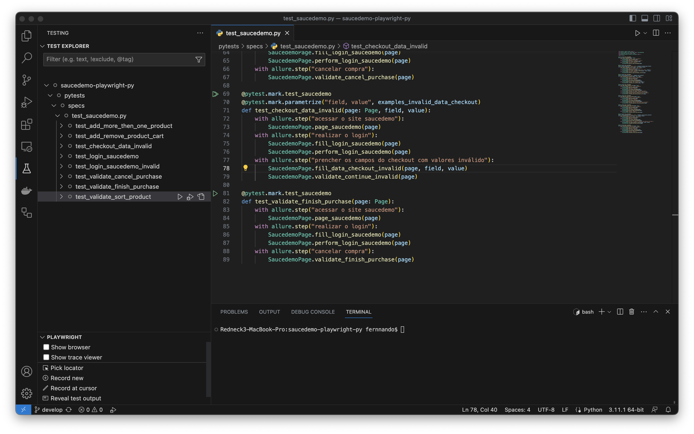
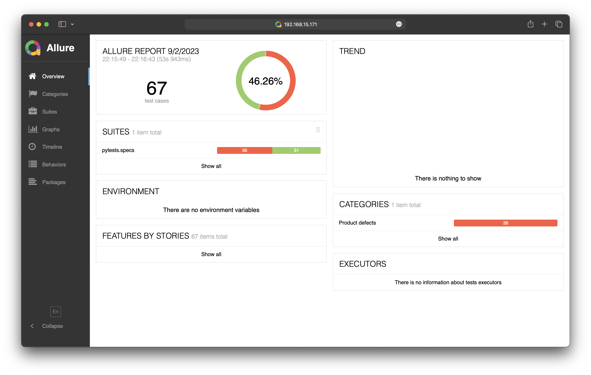

# saucedemo-playwright-py

O Tamplete utilizando Python, Pytest, Playwight, Allure e Faker para realizar testes web de forma simples.

## Recursos e Tecnologias Utilizadas

- Python: Linguagem de programação utilizada para desenvolver a automação de testes.
- Playwright: Biblioteca a fim de centralizar interação com elementos web e browsers.
- Pip: Ferramenta para gerenciar as dependencias e bibliotecas para do Python.
- Allure: Ferramenta para geração de relatórios interativos de testes.
- Pytest: Framework de testes utilizado para executar os testes de forma estruturada.
- Faker: Biblioteca para geração de dados de teste aleatórios.

## Pré-requisitos

- Python 3.11
- Pip
- JDK (para o allure)
- Allure Report
- VSCODE
- Python extension (vscode)

## Execução

- Utilizando os players do próprio VSCODE
- Via terminal com (pytest -k test_saucedemo)
- Utilizando paralelismo (pytest -k test_saucedemo -n auto)

## Evidencia

Muitos testes falhando por bug na aplicação não seguir as regras de negócio

